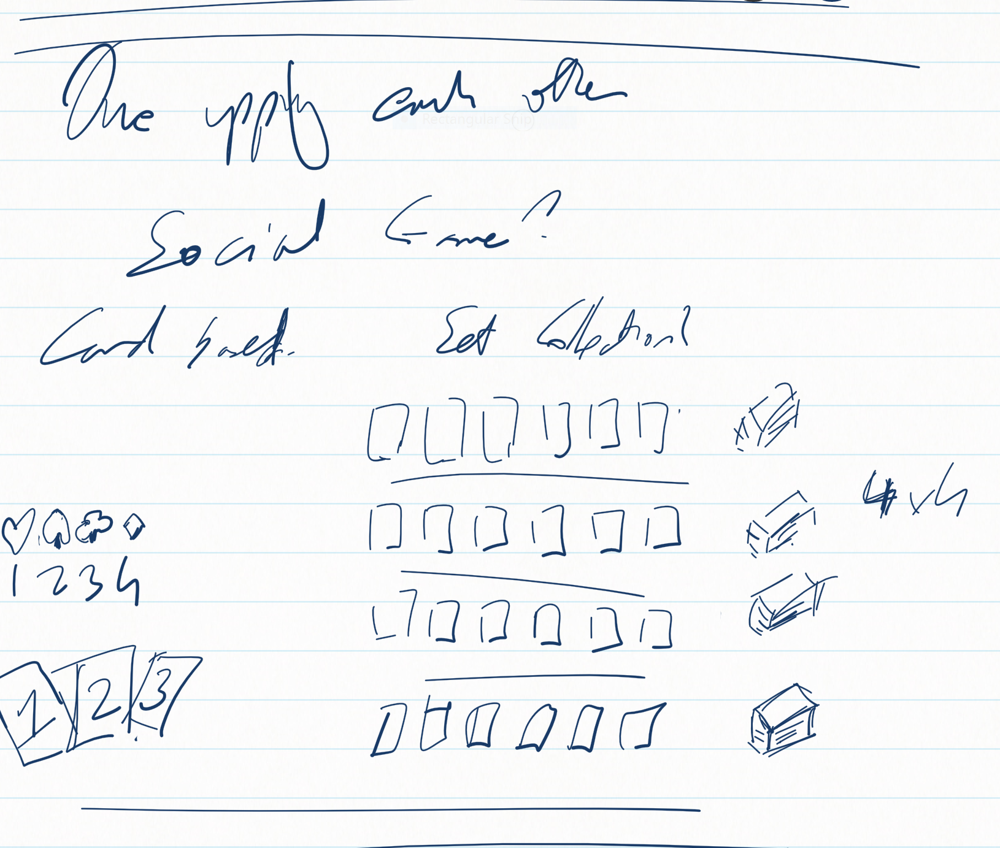

One Up is a game inspired by Hell Village a dice based worker placement game.

The game revolves around trying to collect sets. Currently there is no theme.

Rules:

Components
Deck of power cards - numbered 1 to 3
Deck of collection card - 8 sets of 8
Player tokens

Set up
Split the collections deck into equal decks equal 1 more then the number of players.
Line the decks up and draw the top 6 cards from each deck creating a line leading to the respective desk.
Deal each player 3 power cards/

Turn

_first part is not clear_

Players place their choosen power card and their player token the head of the line of cards they want to take. Taking turns until all players have placed.

Players can place on a line that is empty or has another players power card of a higher number. The other player gets a power card of one lower value, and discards their played power card.

Once all players have placed one power card, they are resolved. Players take cards off the top of the line equal the number on their power card.

Players then draw a new power card.

Players play 6 rounds.

Scoring
Players score points based on the number of sets they collect.

